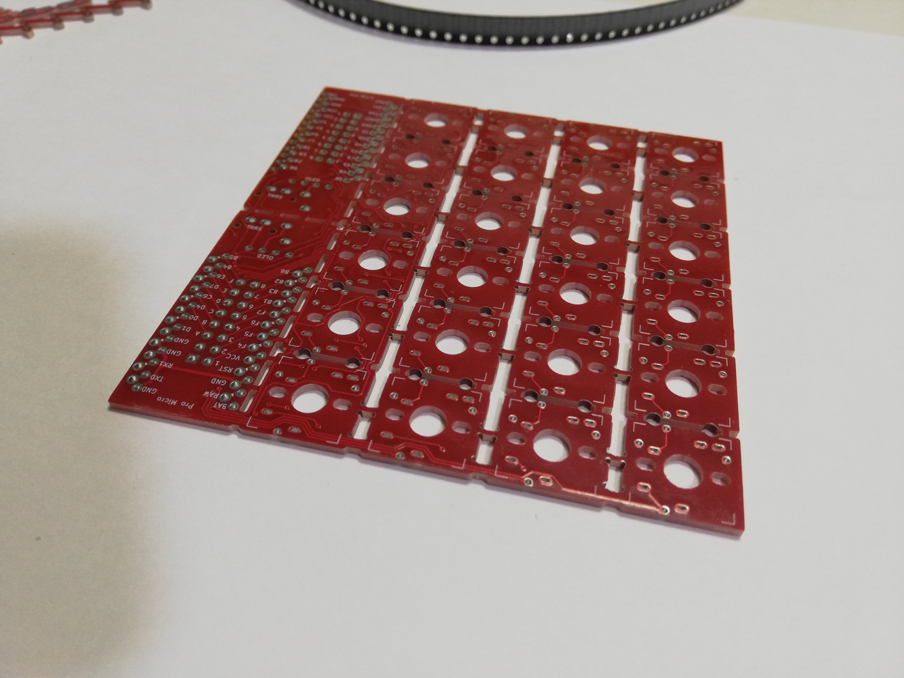
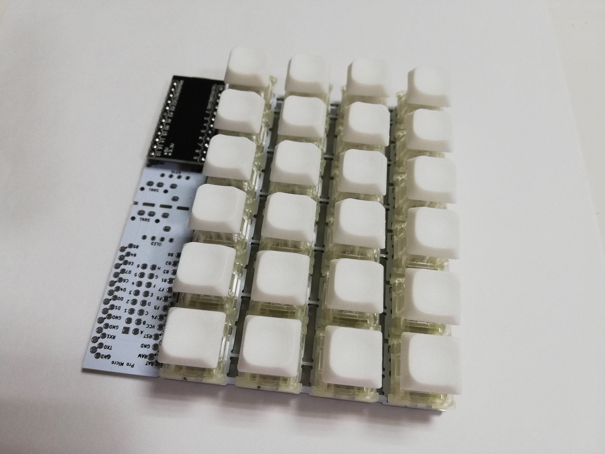

# te96

Expandable keyboard PCB with a smaller pitch.

## What is the te96?

The te96 is a keyboard board that can be assembled and expanded in the same way as the [SU120](https://github.com/e3w2q/su120-keyboard), but with a smaller pitch.

I designed the PCB to make it easy to trial and error a smaller pitch keyboard layout.

You may make Row-Staggered, Column-Staggerd, Ortholinear layouts keyboard.

The "te"(手) is named after the Japanese word for 手助け(help) and 手に馴染む(comfort).

## Why open source?

Anyone interested in keyboard could try the keyboard layout more easily.

## Link

[Hardware data (PCB)](pcb/)

[PCBの入手方法](doc/common/pcb_order_guide_jp.md)

[Firmware](https://github.com/e3w2q/qmk_firmware/tree/e3w2q/keyboards/e3w2q/te96)

<!-- [自由なレイアウトを作成するには](doc/custom_layout/readme_jp.md) -->

## Example

### 24 Key Keypad

[ビルドガイド](doc/kanpyo24/readme_jp.md)

### Row-Staggered Keyboard

[ビルドガイド](doc/natto48/readme_jp.md)

<!-- ### Column-Staggerd Keyboard

[ビルドガイド](doc/tekka38/readme_jp.md)
-->