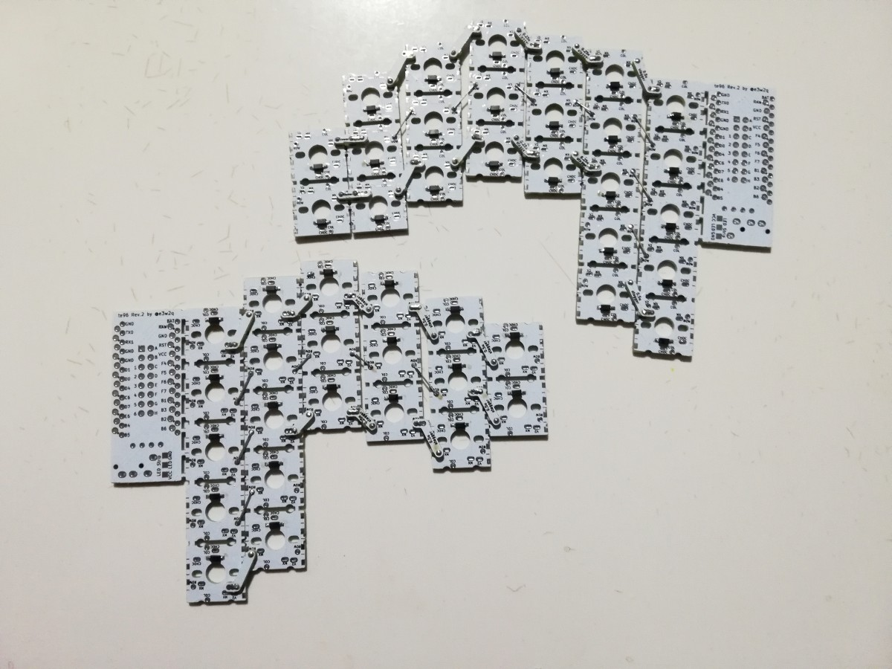
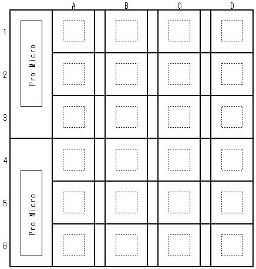
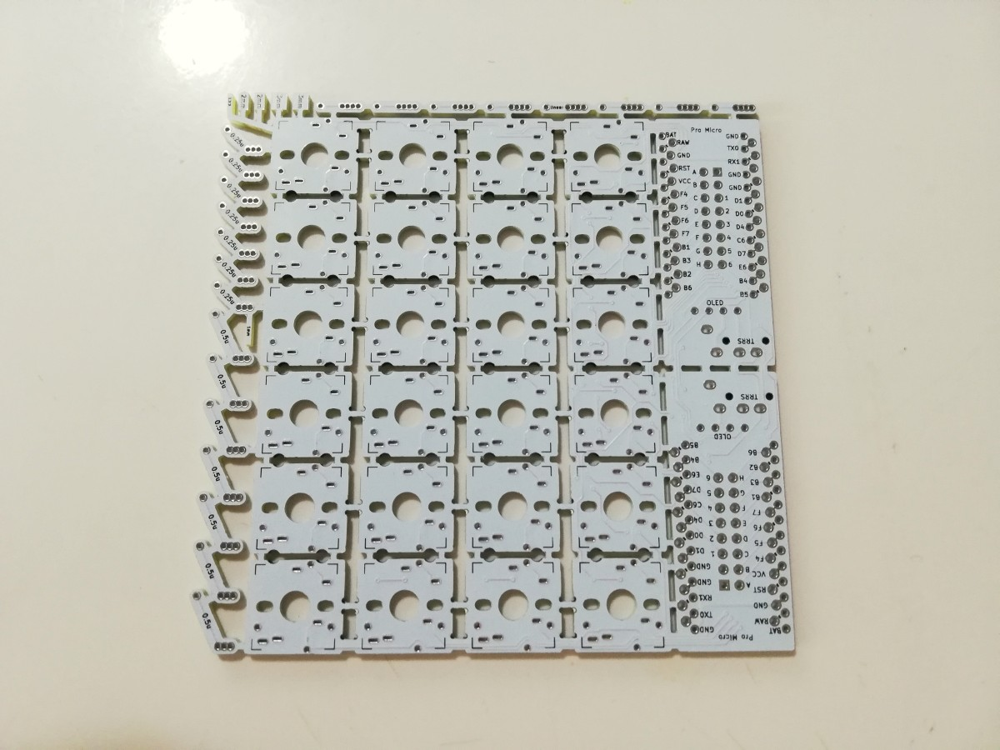
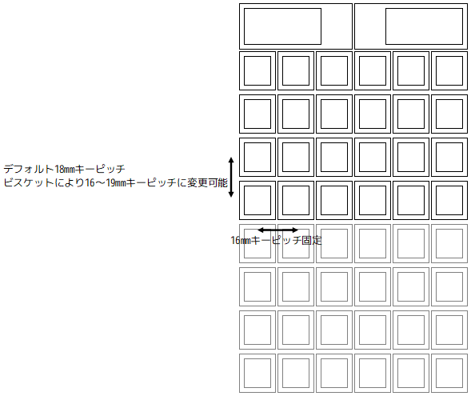
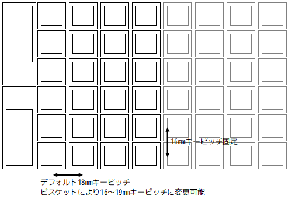
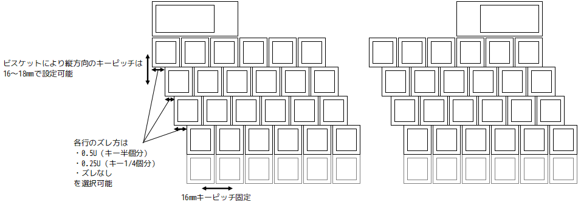
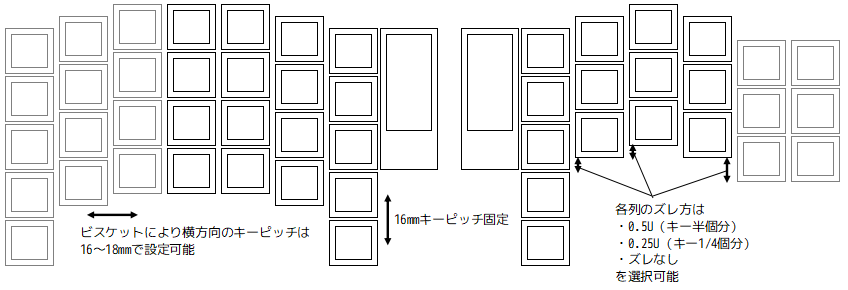
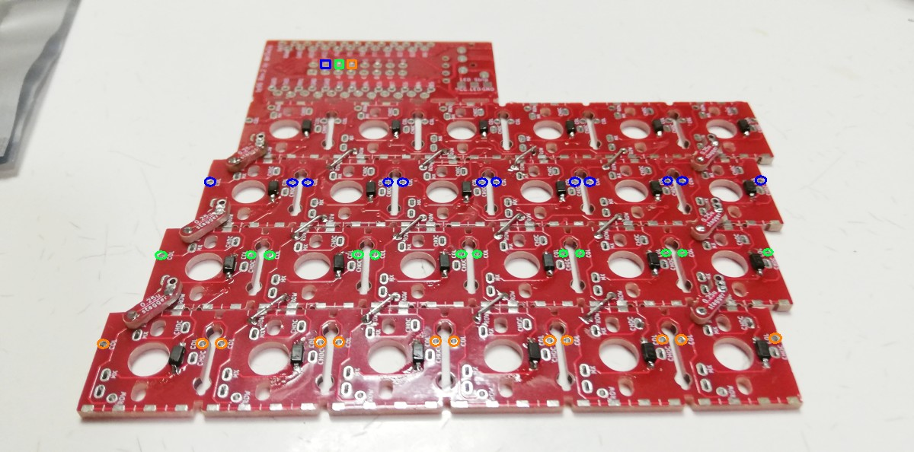

[English](index.md) / [日本語](index_jp.md)

# te96で自由なレイアウトを作成するには



te96では基板間をビスケットで接続することである程度自由なキー配置が可能です。

## 基板の説明

基板1枚に縦6行、横4列、計24キーが配置されています。

基板の表側から見て、横は左からA B C D、縦は上から1 2 3 4 5 6となります。エクセルの番地と同じ考え方です。




## 配置できるキー数の上限

Pro Micro1つにつき横方向に4列まで追加して最大6行8列=48キーまで配置できます。

デフォルトファームウェアでは縦方向に拡張することはできません。


2つのPro MicroをTRRSケーブルで接続することにより、片側48キー、合計96キーの分割キーボードとして使えます。

DuplexMatrixとして配線することで、さらに倍の192キーまで利用可能となりますが、ここでは説明を割愛します。

## カットした基板の接続

カットした基板はビスケットで接続します。基板とビスケットはビンヘッダの軸を差し込んで位置を合わせます。


ビスケットからはみ出しているピンヘッダの軸をニッパーでカットし、ハンダを流し込んで固定します。

## ビスケット

カットした基板を繋ぐために使う部品です。

基板の外周に配置されています。小さいパーツなので、飛んでいかないように手を添えてください。



ビスケットは、キースイッチに干渉しないように、基板の裏側から取り付けます。

staggerと書いてあるビスケットは、Row-Staggered、Column-Staggeredなど、行または列をずらして接続する場合に使います。

0.5u staggerは、キー半個分ずらして接続するときに使います。

0.25u staggerは、キー1/4個分ずらして接続するときに使います。

linearはずらさずに接続するときに使います。

縦に連なっている穴は下から

- 16mmキーピッチ用
- 17mmキーピッチ用
- 18mmキーピッチ用
- 19mmキーピッチ用（linearのみ）

です。


キーに干渉しないように、基板の裏側でビスケットを使って接続します。ビスケットの数が限られているので、下の写真のように、基本的には1つの行または列に対し2個のビスケットを使って接続します。ビスケットの数に余裕があればもっと使っても構いません。


## 作成可能なキーレイアウト

### Ortholinear（オーソリニア）、格子配列

キーが格子状に並んだ配列です。


Pro Microを上部とするように組む場合、以下の注意点があります。

- 拡張方向が縦となるので横長のキーボードには採用しにくい。
- 横方向のキーピッチが16mmとなるのに対し、縦方向のデフォルトキーピッチは18mmとなる。一般的に横方向のキーピッチ≧縦方向のキーピッチとなっていたほうが使いやすいとされるので、ちょっと不向きかも。縦方向のキーピッチを詰めて16mmとするなら問題はない。



Pro Microをサイド側に配置して組むと、横方向に拡張できます。また横方向のキーピッチをデフォルト18mmから、手の大きさに合わせて16～19mmの範囲で変更可能です。



### Row-Staggered（ロウスタッガード）

一般的なキーボードのように横方向にズレた配列です。


各行のズレ方は、使うビスケットによって、0.5Uズレ、0.25Uズレ、ズレなしを選択できます。

拡張方向が縦なので、片手あたりの列数は6が最大です。

縦方向のキーピッチを16～18mmの範囲で変更可能ですが、一般的に横方向のキーピッチ≧縦方向のキーピッチとなっていたほうが使いやすいとされるので、16mmを採用するケースが多いかもしれません。



### Column-Staggered（カラムスタッガード）

自作キーボードでも結構採用されている縦方向にズレた配列です。


各列のズレ方は、使うビスケットによって、0.5Uズレ、0.25Uズレ、ズレなしを選択できます。

拡張方向が横なので、片手あたり6行8列まで使用できます。

横方向のキーピッチを16～18mmの範囲で変更可能です。



## キーマトリクスの配線

### ROW間の配線

ビスケットは配線も兼ねているので、ビスケットの部分の配線は不要です。

下の写真の赤線のように、ビスケットで接続していない部分の`ROW`と`ROW`をハンダめっき線またはダイオードの切れ端などで配線し、ハンダ付けします。


### ROWとPro Microとの配線

1列目をPro Microから切り離していなければプレ配線済みなので別途配線する必要はありません。

### COL間の配線

配線済みですので別途配線する必要はありません。

### COLとPro Microとの配線

切り離した基板の`COL`をPro Microと接続する必要があります。

なお、この配線は、ROW間の配線、ダイオードのハンダ付け、キースイッチのハンダ付けの後に実施するとよいです。先に配線してしまうと、これらのハンダ付けがとても大変です。

下の写真は悪い例です。この後にキースイッチをハンダ付けしようとすると配線をかきわけながらハンダごてを当てないといけません。


Pro Microと各列を繋げていきますが、1列目はPro Microから切り離していなければプレ配線済みなので配線不要です。

2列目の`COL`のどれか（青丸のどれか）と、Pro Micro中央の`B`と書いてあるスルーホール（青四角）を被覆銅線またはポリウレタン銅線で繋ぎます。



Pro Micro側の配線をする際、配線をスルーホールに押し込むとPro Microとショートする可能性があるので注意してください。

ポリウレタン銅線の太さについては、以下のScrapboxの記事が参考になります。

- [ポリウレタン銅線 - Self-Made Keyboards in Japan](https://scrapbox.io/self-made-kbds-ja/ポリウレタン銅線)

3列目の`COL`のどれか（黄緑色の丸のどれか）と、Pro Micro中央の`C`と書いてあるスルーホール（黄緑色の四角）を被覆銅線またはポリウレタン銅線で繋ぎます。

4列目の`COL`のどれか（オレンジ色の丸のどれか）と、Pro Micro中央の`D`と書いてあるスルーホール（オレンジ色の四角）を被覆銅線またはポリウレタン銅線で繋ぎます。

残りのすべての列も同様に`E`、`F`、`G`…に接続してください。

## ファームウェア

以下のリンク先を参考にして、QMK Firmwareのビルド環境を用意します。

- Windows
  - [QMKビルド環境の構築(Windows Msys2編)](https://gist.github.com/e3w2q/4bc86e531d1c893d3d13af3e9895a94a)
- macOS
  - [セットアップ - QMK Firmware](https://docs.qmk.fm/#/ja/newbs_getting_started?id=macos)
- Linux
  - [セットアップ - QMK Firmware](https://docs.qmk.fm/#/ja/newbs_getting_started?id=linux)

構築中、

```
qmk setup
```

と入力する代わりに

```
qmk setup e3w2q/qmk_firmware --branch e3w2q
```

と入力してください。

または、`qmk setup`した後に、`C:\Users\USER_NAME\qmk_firmware\keyboards`配下に[https://github.com/e3w2q/qmk_firmware/tree/e3w2q/keyboards/e3w2q](https://github.com/e3w2q/qmk_firmware/tree/e3w2q/keyboards/e3w2q)以下をコピーしてもよいです。

### 左サイドにPro Microがある向きで使用する場合

`qmk_firmware/keyboards/e3w2q/te96/rev1/`配下にあるキーマップを書き換えてご利用ください。

デフォルトファームウェアを書き込むには以下を実行します。

```
qmk flash -kb e3w2q/te96/rev1 -km default
```
### 上側にPro Microがある向きで使用する場合

`qmk_firmware/keyboards/e3w2q/te96/rev1_transpose/`配下にあるキーマップを書き換えてご利用ください。

デフォルトファームウェアを書き込むには以下を実行します。

```
qmk flash -kb e3w2q/te96/rev1_transpose -km default
```

### Pro Microが向かい合う形で使用する場合

`qmk_firmware/keyboards/e3w2q/te96/rev1_inverted/`配下にあるキーマップを書き換えてご利用ください。

デフォルトファームウェアを書き込むには以下を実行します。

```
qmk flash -kb e3w2q/te96/rev1_inverted -km default
```
### テスト用のキーマップ

デフォルトキーマップのほかに、テスト用のキーマップを用意しています。

テスト用のキーマップでは、入力したキーの論理的な配置（例えば表から見たときに1行目A列のキーなら「A1」）が入力されます。

[QMK Configuratorのテストモード](https://config.qmk.fm/#/test)を使わずに全キーの入力テストを行う際にご利用ください。

- 左サイドにPro Microがある向きで使用する場合
  ```
  qmk flash -kb e3w2q/te96/rev1 -km test
  ```
- 上側にPro Microがある向きで使用する場合
  ```
  qmk flash -kb e3w2q/te96/rev1_transpose -km test
  ```
- Pro Microが向かい合う形で使用する場合
  ```
  qmk flash -kb e3w2q/te96/rev1_inverted -km test
  ```
### ファームウェアの書き込み

`Detecting USB port, reset your controller now...`と表示されたらPro Microの`GND`と`RST`をピンセットやクリップなどで短絡させると書き込みが始まります。


