# Column-Staggered Keyboard

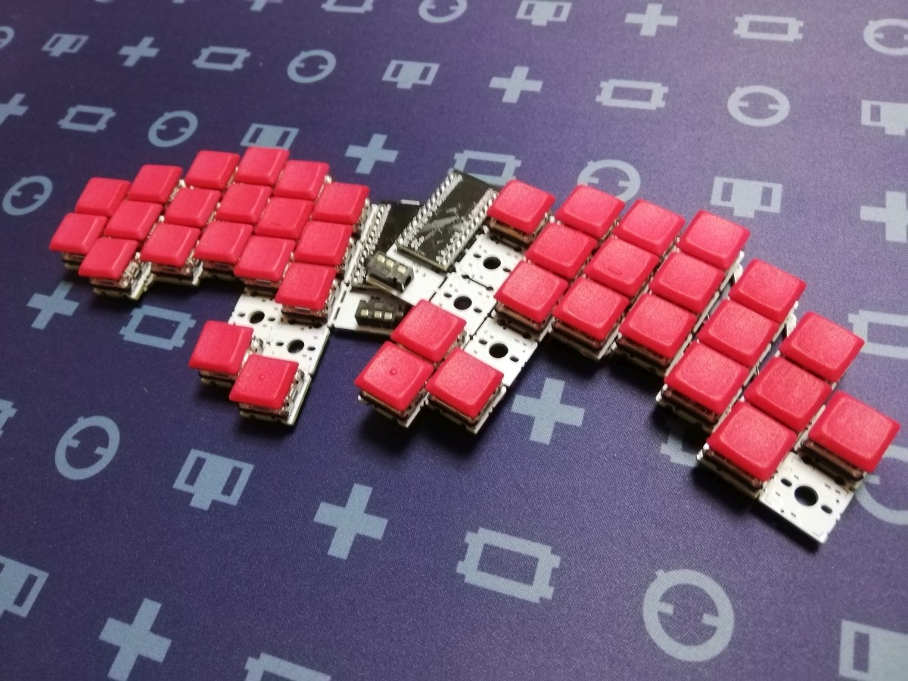

縦16mmキーピッチ、横は16～18mmキーピッチのColumn-Staggerdキーボード（縦方向にズレたキーボード）の作例です。

<!-- TOC -->

- [Column-Staggered Keyboard](#column-staggered-keyboard)
    - [必要なパーツ](#必要なパーツ)
    - [使用する道具、消耗品](#使用する道具消耗品)
    - [ビルドガイド](#ビルドガイド)
        - [Pro Microのもげ防止加工](#pro-microのもげ防止加工)
        - [基板のカット](#基板のカット)
        - [基板側面のヤスリがけ](#基板側面のヤスリがけ)
        - [はんだ付けのイメージトレーニング](#はんだ付けのイメージトレーニング)
        - [カットした基板の結合](#カットした基板の結合)
        - [隣り合う場所の配線](#隣り合う場所の配線)
        - [ダイオードの取り付け](#ダイオードの取り付け)
        - [Pro Microの取り付け（Pro Micro付属のピンヘッダを使う場合）](#pro-microの取り付けpro-micro付属のピンヘッダを使う場合)
        - [Pro Microの取り付け（コンスルーピンヘッダを使う場合）](#pro-microの取り付けコンスルーピンヘッダを使う場合)
        - [TRRSコネクタの取り付け](#trrsコネクタの取り付け)
        - [キースイッチの取り付け](#キースイッチの取り付け)
        - [離れている場所の配線](#離れている場所の配線)
        - [キーキャップの取り付け](#キーキャップの取り付け)
        - [ゴム足の取り付け](#ゴム足の取り付け)
        - [ファームウェアの書き込み](#ファームウェアの書き込み)
    - [トラブルシューティング](#トラブルシューティング)

<!-- /TOC -->

## 必要なパーツ

[te96 パーツリスト](../common/bom_list_jp.md)をご覧ください。

te96基板は3枚使用します。

## 使用する道具、消耗品

[使用する道具、消耗品](../common/tool_guide_jp.md)におすすめの道具類、注意事項等をまとめましたのでご覧ください。

## ビルドガイド

### Pro Microのもげ防止加工

Pro Microにエポキシ接着剤を盛って、簡単にはもげないようにします。

参考1:[ProMicroのモゲ防止ついでにQMK_Firmwareを書き込む - Qiita](https://qiita.com/hdbx/items/2f3e4ddfcadda2a5578e)
参考2:[もげ予防 - Self-Made Keyboards in Japan](https://scrapbox.io/self-made-kbds-ja/%E3%82%82%E3%81%92%E4%BA%88%E9%98%B2)

エポキシ接着剤の2液を混ぜます。


接着剤を付け始める前にMicro USBコネクタを横から見てください。側面に穴が開いています。この穴に接着剤が入ると端子が入らなくなったり、入りにくくなったりします。


この穴を避けて、つまようじなどで接着剤を盛っていきます。


乾くまで置いておきます。

### 基板のカット

下の図のように、ニッパーで切っていきます。ニッパーで表裏に切れ目を入れてから手で折り割ってください。

Pro Micro部は左右のどちらを残しても動きます。分割キーボードでPro Micro部を左右対称にしたい場合は注意してください。

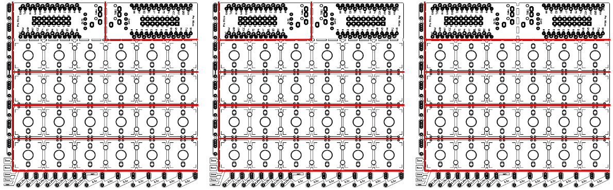

基板を並べてみて、自分の手に合ったちょうどよいズレ方を探します。縦方向のズレは

- ズレなし
- 0.25Uズレ
- 0.5Uズレ

を選べます。

各列の隙間は、

- 隙間なし（16mmキーピッチ）
- 1mm隙間あり（17mmキーピッチ）
- 2mm隙間あり（18mmキーピッチ）

を選べます。

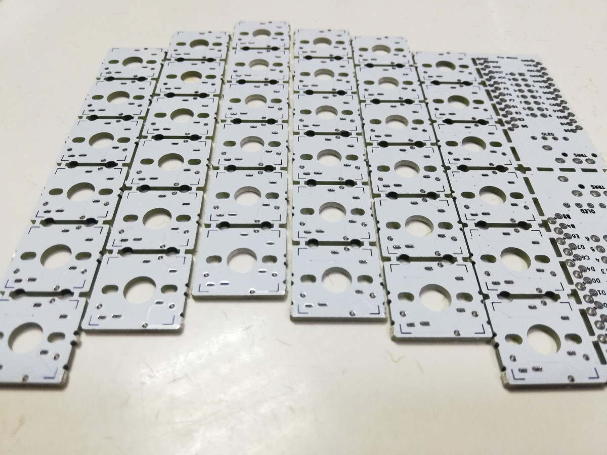

使わない部分をカットします。


### 基板側面のヤスリがけ

机に紙ヤスリを置き、その上で基板のバリがある側面をヤスリがけします。粗目だけでも結構きれいになります。お好みで細目までかけてもよいです。

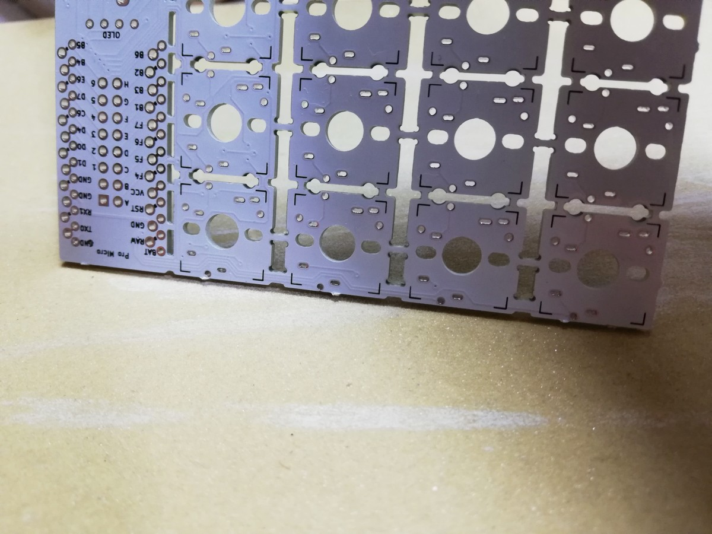

### はんだ付けのイメージトレーニング

はんだ付けに慣れている方は次の項に進んでください。

全くはんだ付けをしたことがなかったり、数年ぶりにはんだ付けをする場合は、以下の動画が参考になります。

- [はんだ付けの詳細.m2p - YouTube](https://www.youtube.com/watch?v=ZA-ehWjRfYM)

- [チップ抵抗のはんだ付けと、はんだ量の調整（体験用基板を使用） - YouTube](https://www.youtube.com/watch?v=vqKKElJ1vw0)

- [基礎からわかる！自キ入門講座 第8回「自作キーボードのつくりかた #2」 - YouTube](https://www.youtube.com/watch?v=LOC53FeU-QM&t=999)

### カットした基板の結合

まず**カットした基板を表側にして完成形に並べてからマスキングテープで仮止めしておいてください**。これをせずに進めて、表に向けたときに想定したずらし方と逆になっていたことがありました。

基板を裏返し、ビスケットで結合していきます。ビスケットは3種類あります。下の写真の左から

- 0.5uずらして接続する用
- 0.25uずらして接続する用
- ずらさずに接続する用

です。

縦に連なっている穴は下から

- 16mmキーピッチ用
- 17mmキーピッチ用
- 18mmキーピッチ用
- 19mmキーピッチ用（ずらさずに接続する用のみ）

です。

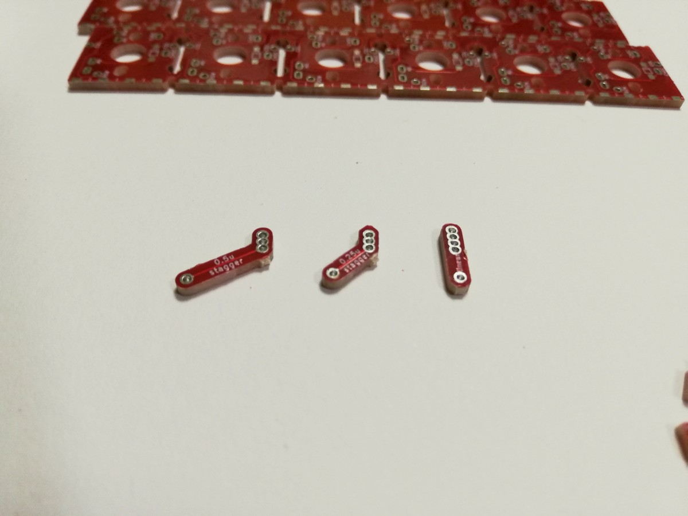

基板を裏返してビスケットで接続していきます。ビスケットの数が限られているので、下の写真のように、基本的には各列2個のビスケットを使って接続します。ビスケットの数に余裕があればもっと使っても構いません。

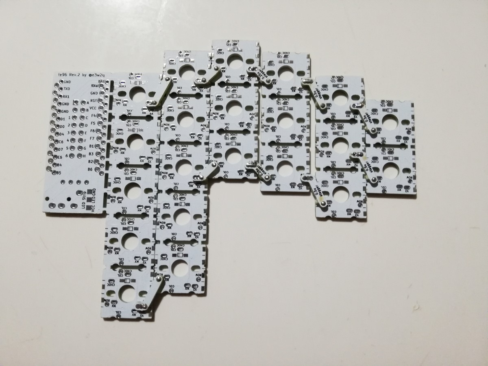

基板の`ROW`と書かれている穴にビスケットを重ねて、ビンヘッダを差し込みます。


ビスケットからはみ出しているピンヘッダをニッパーでカットして、穴の上からハンダを流し込みます。

16mmキーピッチで接続する場合は基板と基板をくっつけてビスケットで接続すればよいのですが、1mm間隔を空けて17mmキーピッチにしたい場合は、基板に付属の1mmスペーサーをニッパーで切って基板の間に挟んで間隔を空けてください。

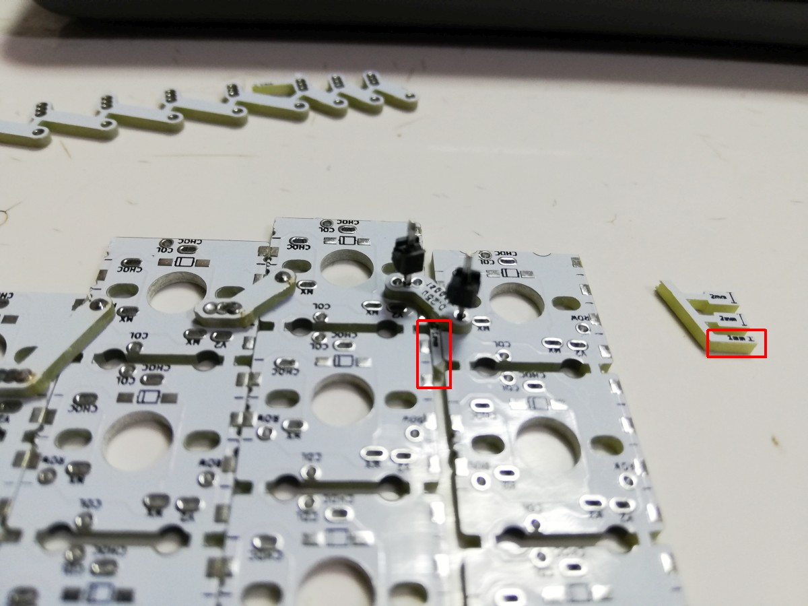

2mm間隔を空けて18mmキーピッチとしたい場合、同様に基板に付属の2mmスペーサーを使ってください。

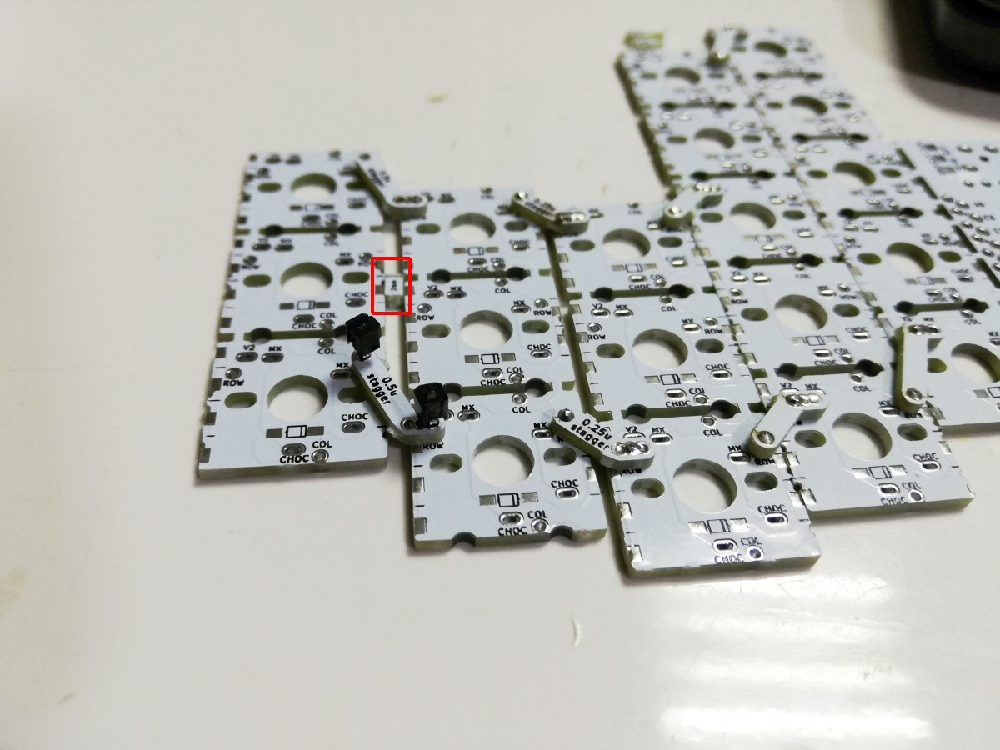

上下で間隔を変えて、扇形のようにすることも可能です。


### 隣り合う場所の配線

下の写真の赤線のように、ビスケットで接続していない部分の`ROW`と`ROW`をハンダめっき線またはダイオードの切れ端などで配線し、ハンダ付けします。


### ダイオードの取り付け

基板裏側にキースイッチの数だけダイオードを取り付けます。

キースイッチの枠が描いてあるほうが基板の表で、ダイオードの印が描いてあるほうが裏です。

まず片方のパッド上にはんだを溶かして盛ります。


ダイオードをピンセットでつまみ、基板のシルク印刷の二重線と、表面実装ダイオードの二重線の向きを合わせて、パッドに置きます。

先程パッドに盛ったはんだを溶かしてダイオードの片側をはんだ付けします。

うまくいかない場合は以下の動画をご覧ください。

- [チップ抵抗のはんだ付けと、はんだ量の調整（体験用基板を使用） - YouTube](https://www.youtube.com/watch?v=vqKKElJ1vw0)


表面実装ダイオードのはんだ付けをしていない側をはんだ付けします。


### Pro Microの取り付け（Pro Micro付属のピンヘッダを使う場合）

**基板表側**のPro Micro設置部分のジグザグスルーホールに、Pro Microに付属している12ピンのピンヘッダの短い側を根本まで差し込みます。

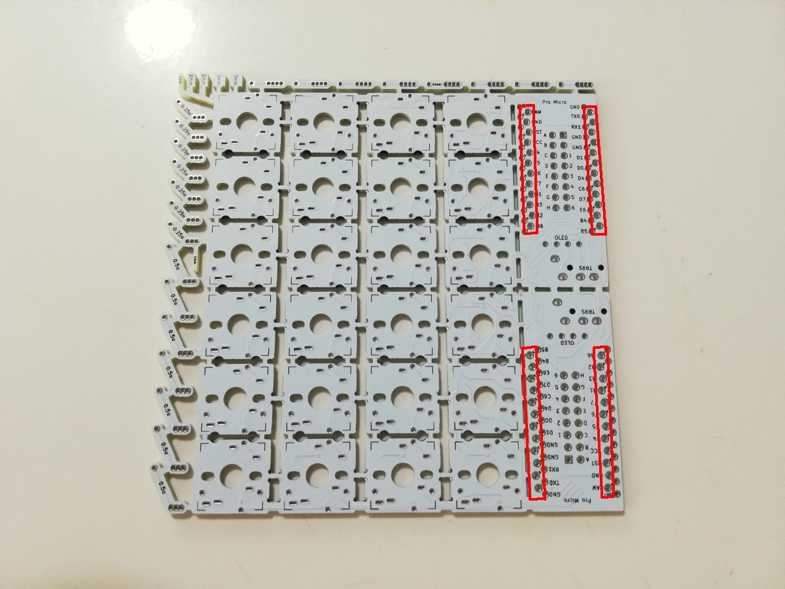

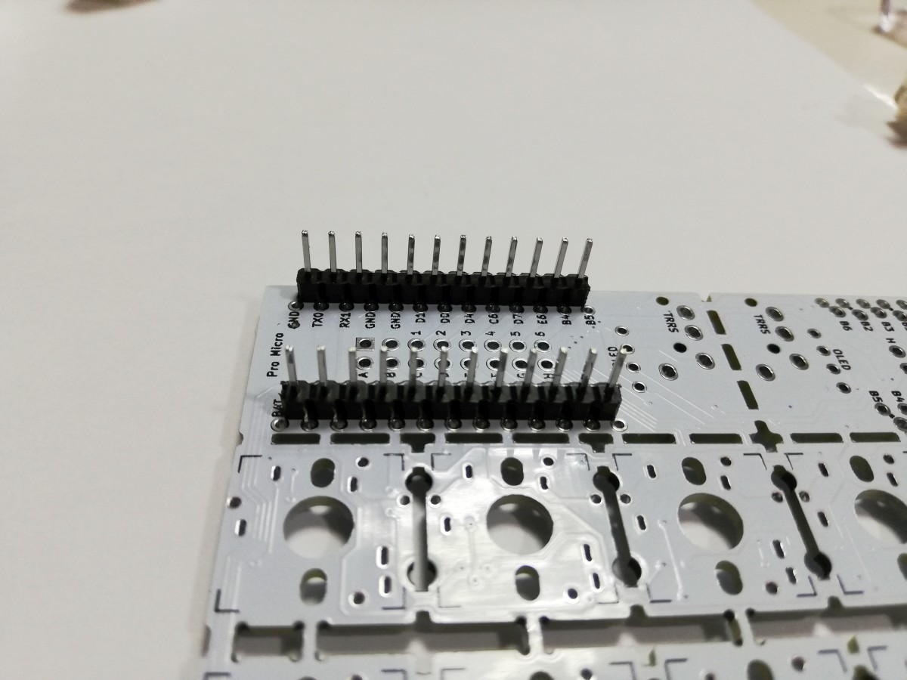

スルーホールがジグザグになっているので、少し入れにくくなっています。ゆっくり押し込んでください。

ピンヘッダにPro Microを差し込みます。**Pro Microの裏面（平らなほう）が上になるように、またマイクロUSBが基板端になるように**します。

**向きを間違えるとリカバリーが大変です。表裏、左右をよく確認してください。**

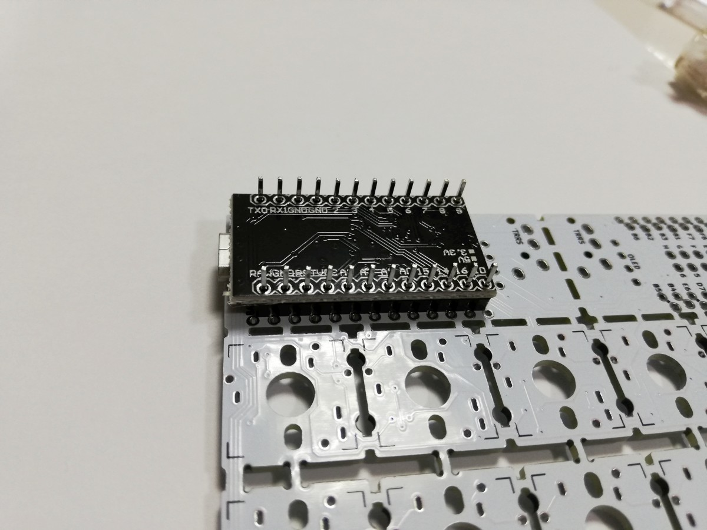

ニッパーでピンヘッダの足のはみ出している部分を切ってから、Pro Microとピンヘッダをハンダ付けします。まず四隅をハンダ付けし、横から見てピンヘッダとの間に隙間があれば押さえながらハンダを温めて浮かないようにします。そのあと、順番に全てハンダ付けします。

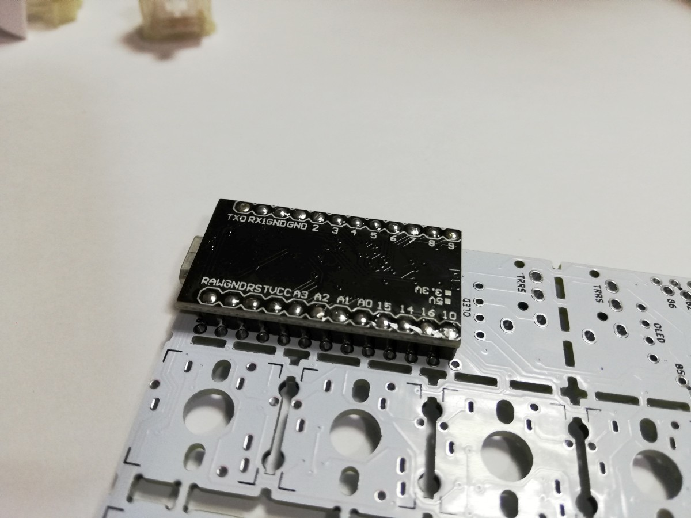

基板とピンヘッダはジグザグのスルーホールで接触しているため、ハンダ付けはしなくても経験的には大丈夫ですが、接触不良が気になる場合ははんだ付けしてください。

|            | 基板とピンヘッダをはんだ付けしない                           | 基板とピンヘッダをはんだ付けする                             |
| ---------- | ------------------------------------------------------------ | ------------------------------------------------------------ |
| メリット   | はんだ付け箇所が減る<br />Pro MicroのMicro USBがモゲたときに交換できる | キーが反応しないとき、接触不良をまず疑うべき箇所が減らせる   |
| デメリット | 接触不良により行単位、列単位でキーが反応しない場合がある     | はんだ付け箇所が増える<br />Pro MicroのMicro USBがモゲたときに交換が難しい |

### Pro Microの取り付け（コンスルーピンヘッダを使う場合）

**基板表側**のPro Micro設置部分のジグザグではないスルーホール（一番外側の穴を除く）に、別途調達したコンスルーピンヘッダを根本まで差し込みます。

その際、

- コンスルーピンヘッダの金色の窓が遠い側を基板側とし、金色の窓が近い側をProMicro側とする
- 金色の窓の向きを揃える

ようにしてください。

参考: [Helixベータ ビルドガイド](https://github.com/MakotoKurauchi/helix/blob/master/Doc/buildguide_jp.md#pro-micro)

ピンヘッダにPro Microを差し込みます。**Pro Microの裏面（平らなほう）が上になるように、またマイクロUSBが基板端になるように**します。

**向きを間違えるとリカバリーが大変です。表裏、左右をよく確認してください。**

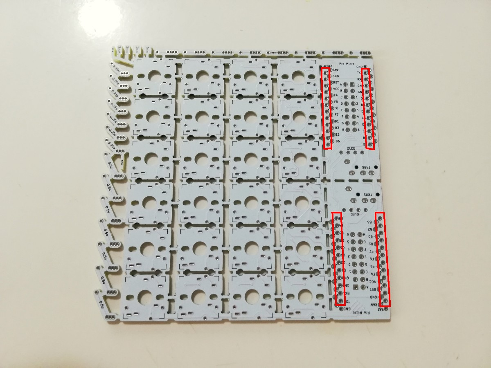

Pro Microとコンスルーピンヘッダをハンダ付けします。まず四隅をハンダ付けし、横から見てコンスルーピンヘッダとの間に隙間があれば押さえながらハンダを温めて浮かないようにします。そのあと、順番に全てハンダ付けします。

基板とコンスルーピンヘッダは接触しているため、ハンダ付けしません。

### TRRSコネクタの取り付け

表側から差し込みます。まず裏側の一箇所をハンダ付けし、コネクタが基板から浮いていないか確認します。もし浮いていれば、コネクタを押さえながらハンダを温めて溶かし直してください。

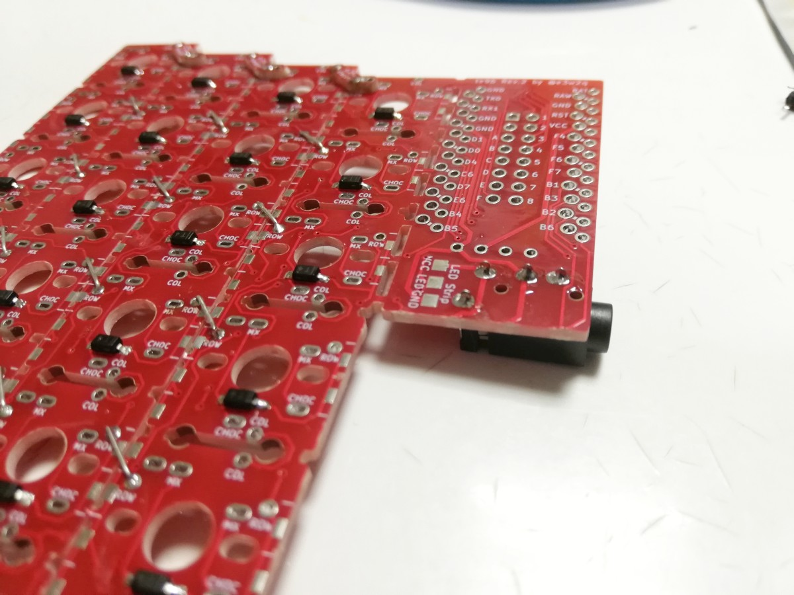

### キースイッチの取り付け

表側から差し込みます。トッププレート無しでもキースイッチのガタつきがないよう、穴のサイズを小さめにしてあります。キースイッチの足が曲がっている場合はまっすぐにしてから差し込んでください。

裏返してハンダ付けします。

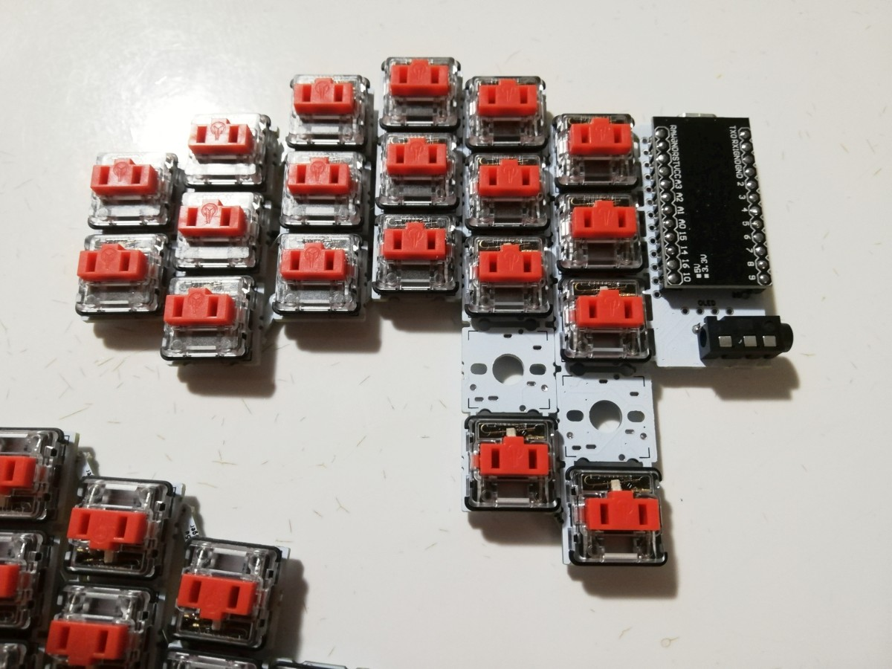

### 離れている場所の配線

切り離した基板の`COL`をPro Microと接続していきます。

1列目はPro Microと接続したままなので配線不要です。

2列目の`COL`のどれかと、Pro Micro中央の`B`と書いてあるスルーホールを被覆銅線またはポリウレタン銅線で繋ぎます。

Pro Micro側の配線をする際、配線をスルーホールに押し込むとPro Microとショートする可能性があるので注意してください。

3行目の`COL`のどれか（黄緑色の丸のどれか）と、Pro Micro中央の`C`と書いてあるスルーホール（黄緑色の四角）を被覆銅線またはポリウレタン銅線で繋ぎます。

4行目の`COL`のどれか（オレンジ色の丸のどれか）と、Pro Micro中央の`D`と書いてあるスルーホール（オレンジ色の四角）を被覆銅線またはポリウレタン銅線で繋ぎます。

残りのすべての列も同様に`E`、`F`、`G`…に接続してください。

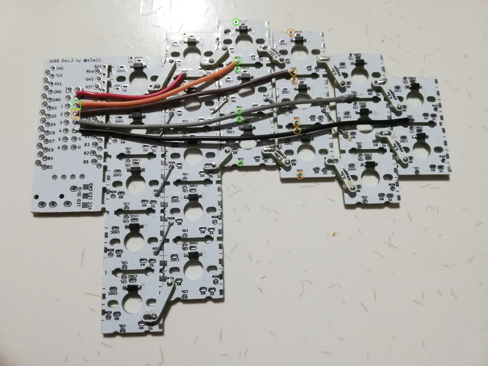

### キーキャップの取り付け

キースイッチにキーキャップをはめます。


### ゴム足の取り付け

ゴム足を裏面に取り付けます。ソケットやキースイッチに接触する場合はハサミで切ってから取り付けます。

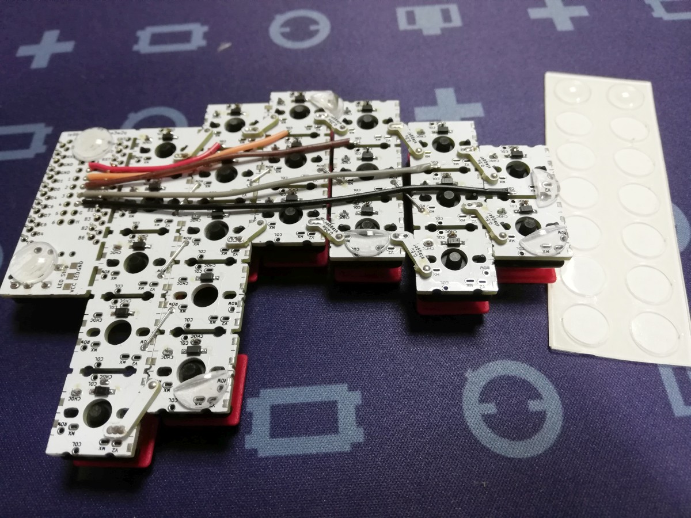

試打してみて、基板のたわみが気になればゴム足を増やしてください。

### ファームウェアの書き込み

以下のリンク先を参考にして、QMK Firmwareのビルド環境を用意します。

- Windows
  - [QMKビルド環境の構築(Windows Msys2編)](https://gist.github.com/e3w2q/4bc86e531d1c893d3d13af3e9895a94a)
- macOS
  - [セットアップ - QMK Firmware](https://docs.qmk.fm/#/ja/newbs_getting_started?id=macos)
- Linux
  - [セットアップ - QMK Firmware](https://docs.qmk.fm/#/ja/newbs_getting_started?id=linux)

構築中、

```
qmk setup
```

と入力する代わりに

```
qmk setup e3w2q/qmk_firmware --branch e3w2q
```

と入力してください。

または、`qmk setup`した後に、`C:\Users\USER_NAME\qmk_firmware\keyboards`配下に[https://github.com/e3w2q/qmk_firmware/tree/e3w2q/keyboards/e3w2q](https://github.com/e3w2q/qmk_firmware/tree/e3w2q/keyboards/e3w2q)以下をコピーしてもよいです。

用意されたキーマップを書き込むには以下を実行します。

注：完成写真の左手側の配列で両手分作った場合のキーマップとなっています。

```
qmk flash -kb e3w2q/te96/rev1_inverted -km kappa38
```

`Detecting USB port, reset your controller now...`と表示されたらPro Microの`GND`と`RST`をピンセットやクリップなどで短絡させると書き込みが始まります。


[QMK Configuratorのテストモード](https://config.qmk.fm/#/test)でキー入力が行えるかテストしてください。

## トラブルシューティング

- 特定のキーが反応しない
  - キースイッチのハンダ付けが甘い場合があります。キースイッチを押すかわりに、キースイッチの裏面のハンダ2箇所をピンセットでショートさせてみて、入力されるか確認してください。入力される場合は、ハンダ付けし直してください。
- 行、列単位でキーが反応しない
  - Pro Microの足と基板のZigzag穴とがうまく導通していない可能性があります。該当する行または列のPro Microの足を基板のスルーホールの壁に押し付けた状態でキー入力ができるか試してください。この状態でキー入力ができる場合は、きちんと導通するようにPro Microの足が基板の穴の壁に接するようにちょっと曲げてから差し込んでみてください。はんだ付けしてしまうのもよいです。
